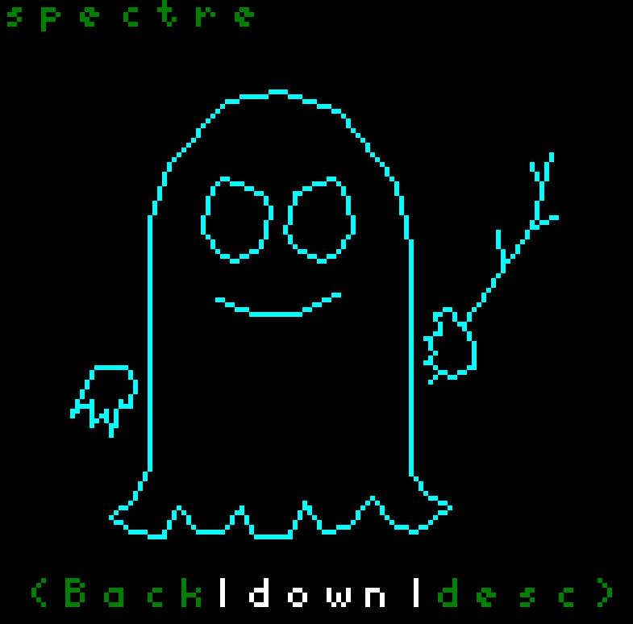
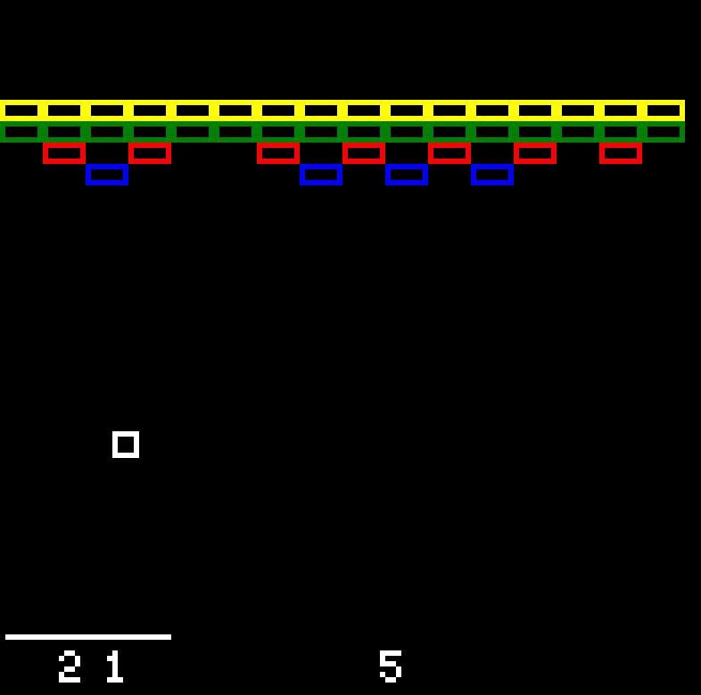
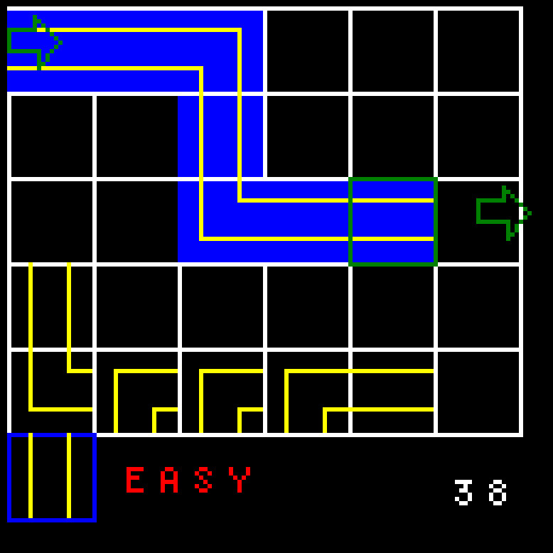
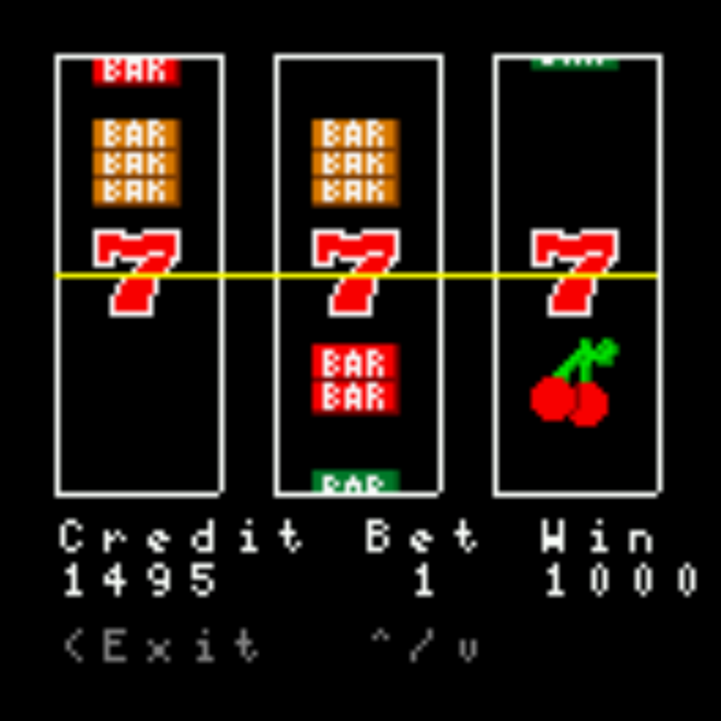

## Games

### Lunar Rescue
a lunar lander type game in which you must rescue your fellow astronauts and transport them to the lunar base

### Badge Monsters
You've heard of Pokemon Go? This is not at all like that. Not at all.

### Smashout
Similar to Breakout on the ATARI VCS

### Hacking Sim
Route the Inter Tubes to make the data flow

### Spinning Cube
Does what it says on the tin

### Game of Life
Conway's game of life

### Slot Machine
Wild Cherry style slot machine.

## Other
| name     | description |
| ----------- | ---------- |
| Schedule    | The Schedule badge app shows you the schedule for the 2021 RVAsec conference. |
| About Badge | The About Badge badge app displays a link to this web page. |
| Blinkenlights | makes the badge LED lights blink |
| Conductor | allows you to make beep boop sounds |
| Settings | backlight & RBG LED brightness, audio enable, rotation control, and user name |
| Screensaver | various screensavers |

## Making your own Badge Apps
If you know C, making your own badge apps is not that difficult. You can test out your app withot having to flash the firmware using our handy dandy linux badge emulator. Once you're satisfied, you can build the firmware and flash the pico over a USB-A to USB-B micro cable. Customize your badge and stretch those creative muscles!

To get started, start with the repository [README.md](https://github.com/HackRVA/badge2023/blob/main/README.md).

