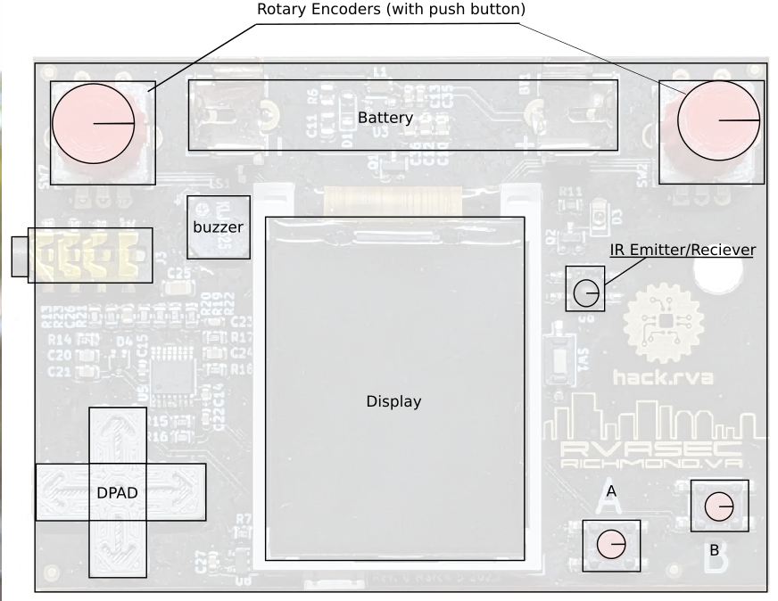

# Hardware

| Component | Description |
|-----------|-------------|
| **Processor** | RP2040 microcontroller chip, with dual-core ARM Cortex M0+ processors, clocked at up to 133MHz, 264KB of SRAM, and 2MB of onboard Flash memory |
| **Display** | 132x132 pixels, 16 bit Color TFT |
| **Power** | USB or AA battery |
| **Inputs** | - D-PAD   - Encoder/Buttons   - IR Receiver   - A/B buttons |
| **Outputs** | - IR LED   - Speaker   - RGB LED |

